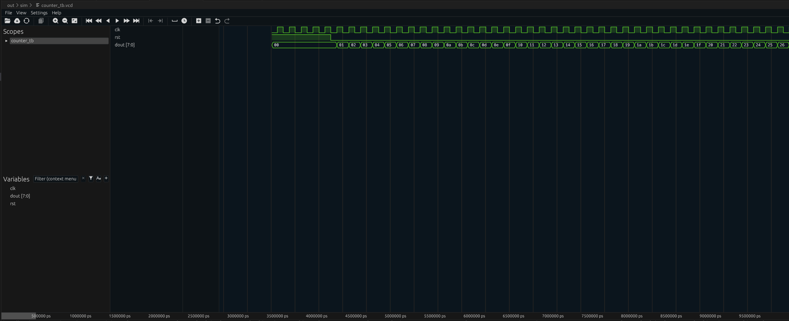

Verilator has traditionally been used for co-simulation, with testbenches written in C++.
With recent versions, it can now also handle pure Verilog simulation. Here's how.

<!--more-->

## Installing Verilator using Dev Containers

First, we will have to install Verilator.
We'll probably need more tools of the OSS CAD suite later on, so it makes sense to install the complete [OSS CAD Suite
](https://github.com/YosysHQ/oss-cad-suite-build/) toolkit.

I prefer installing the tools in a container, as this allows for a reproducible setup that can be used everywhere containers can be used.
When using VS Code's [Dev Containers](https://code.visualstudio.com/docs/devcontainers/containers), we can just open the repository in any VS Code installation and it will automatically set up the container and tools.
Furthermore, you could use the same container in CI for automated testing with a 100% compatible environment.

We'll set up the Dev Container with customizable OSS CAD Suite version and based on Ubuntu LTS, so we don't have to update the configuration so often.

Let's create the `.devcontainer/devcontainer.json` configuration:
```json
// For format details, see https://aka.ms/devcontainer.json. For config options, see the
// README at: https://github.com/devcontainers/templates/tree/main/src/javascript-node
{
    "name": "osscad",
    "build": {
        "dockerfile": "Dockerfile",
        "args": {
            "OSSCAD_VERSION": "2025-01-15"
        }
    },
    // For podman / SELinux
    "runArgs": [
        "--userns=keep-id",
        "--security-opt=label=disable"
    ],
    // To program FPGA devices from within the container
    "mounts": [
        "source=/dev,target=/dev,type=bind"
    ],
    "customizations": {
        "vscode": {
            "extensions": [
                "surfer-project.surfer",
                "mshr-h.veriloghdl"
            ]
        }
    }
}
```
There is no ready to use docker image for OSS CAD Suite, so we will build one using the `Dockerfile`.
The OSS CAD Suite version can be specified in `OSSCAD_VERSION`.
Adding a mount point for `/dev` will enable using `iceprog` in the container, if we later want to use it to program FPGAs.
In addition, we include a workaround for the [Podman SELinux issue](), the [Surfer](https://surfer-project.org/) waveform viewer and Verilog HDL support.

The `.devcontainer/Dockerfile` then looks like this:
```Dockerfile
FROM docker.io/ubuntu:24.04
ARG OSSCAD_VERSION

RUN apt-get update && \
    DEBIAN_FRONTEND=noninteractive apt-get -qq -y install curl git sudo build-essential locales \
    && apt-get clean

RUN echo 'ubuntu ALL=(ALL) NOPASSWD:ALL' > /etc/sudoers.d/ubuntu && \
    chmod 0440 /etc/sudoers.d/ubuntu && \
    sed -i -e 's/# en_US.UTF-8 UTF-8/en_US.UTF-8 UTF-8/' /etc/locale.gen && \
    dpkg-reconfigure --frontend=noninteractive locales && \
    update-locale LANG=en_US.UTF-8

ENV LANG en_US.UTF-8 

RUN cd /opt && \
    export OSSCAD_VERSION_SHORT=$(echo "${OSSCAD_VERSION}" | sed 's/-//g') && \
    curl --progress-bar -L "https://github.com/YosysHQ/oss-cad-suite-build/releases/download/${OSSCAD_VERSION}/oss-cad-suite-linux-x64-${OSSCAD_VERSION_SHORT}.tgz" -o osscad.tgz && \
    tar -xf osscad.tgz && \
    rm osscad.tgz && \
    echo "${OSSCAD_VERSION}" > /opt/oss-cad-suite/VERSION && \
    echo "source /opt/oss-cad-suite/environment" >> /home/ubuntu/.bashrc
```

It installs some basic dependencies and sets up `sudo` and the locale.
It then installs OSS CAD Suite into `/opt` and creates a `VERSION` file in the installation folder.
Finally, it updates `.bashrc` so that the tools are directly available in the VS Code terminal, without having to first manually source the environment file.

## Using in Distrobox

You can also use the container in distrobox now. Just build an image using podman:
```bash
podman build . --build-arg OSSCAD_VERSION="2025-01-15" -t osscad
```
Then create a distrobox container:
```bash
distrobox create osscad -i localhost/osscad:latest
```
And now you can:
```bash
distrobox enter osscad
```

When running from distrobox, you can use graphical tools such as `gtkwave` out of the box.
I couldn't get this working in the VS Code container so far.


  Distrobox doesn't source the environment file, so you'll have to manually do this before using any OSS CAD Suite tool:
  ```bash
  source /opt/oss-cad-suite/environment
  ```


## A Simple Testbench

Now let's see how to set up the simulation.
Create the typical Verilog counter in `src/hdl/counter.v`:
```verilog
`timescale 1ns/1ps

module counter (
    input clk,
    input rst,
    output reg[7:0] dout
);

    always @(posedge clk or posedge rst) begin
        if (rst == 1'b1)
            dout <= 0;
        else
            dout <= dout + 1;
    end
endmodule
```

Then create the testbench in `src/sim/dac_tb.v`:
```verilog
`timescale 1ns/1ps

module counter_tb();

    reg clk, rst;
    wire[7:0] dout;

    initial begin
        $dumpfile("out/sim/counter_tb.vcd");
        $dumpvars();
        clk = 0;
        #10000 $finish;
    end
    always #5 clk = ~clk;

    initial begin
        rst = 1'b1;
        #50 rst = 1'b0;
    end

    counter uut (
        .clk(clk),
        .rst(rst),
        .dout(dout)
    );

endmodule
```

In Verilog, configuration of the simulator is handled directly in the Verilog code, not using parameters for the simulator tool.
The example above shows how to generate the `clk` and `rst` signals.
It also shows how to limit the simulation time using `$finish` and how to dump the variables to `out/sim/counter_tb.vcd`.

## Verilating the Testbench

With the testbench ready, simulating with Verilator is simple, where the most difficult part is finding the correct tool arguments in the documentation.
To avoid having to type the commands all the time, create a simple `sim_counter.sh` script file:
```bash
#!/bin/bash
set -ex

verilator -cc src/sim/counter_tb.v src/hdl/counter.v --binary --trace
./obj_dir/Vcounter_tb
```

The first command compiles the testbench and source files.
`--binary` instructs Verilator to just generate a binary, as we don't want to use the code as a library.
This is needed when the testbench is in Verilog and not in C++, as it's usually done with Verilator.
The `--trace` flag tells Verilator that we want to trace signals into wave form files.

The second command then executes the compiled simulation binary.

## Viewing the Waveforms

To view the result, just open `out/sim/counter_tb.vcd` in VS Code.
This should automatically open the surfer waveform viewer, as it was installed by the `devcontainer.json` file:

