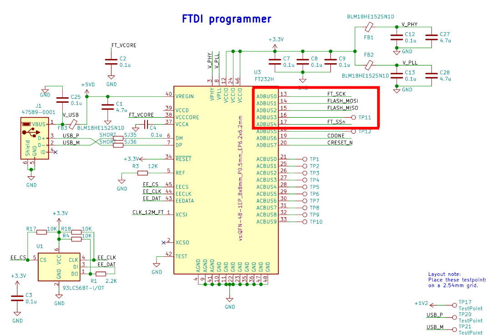
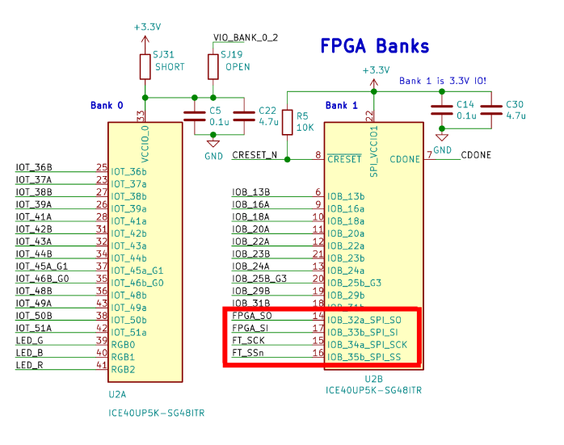

The [Upduino](https://tinyvision.ai/products/fpga-development-board-upduino-v3-1) FPGA development board is a cheap way to start with (OSS) FPGA development on the Lattice ICE40 platform.
Unfortunately, there are few peripherals on the PCB and there's no official way for communicate between FPGA application and PC.
This post explains how we can reuse the FPGA programmer to transmit data to the FPGA without any additional hardware, using only the programmer USB port.

<!--more-->

## The Idea and Schematic

When using the Upduino FPGA, I was looking for a simple way to transfer data from PC to the FPGA.
Ideally, this would even work without any additional hardware.
For example, when using the [Tang Nano](https://wiki.sipeed.com/hardware/en/tang/tang-nano-20k/nano-20k.html) series of FPGA boards, you get the programmer and an UART port one single USB connector.
For the Upduino, there's no official support for this.
But looking at the schematic closely, it turns out we can improvise something.

When looking at the FTDI part of the schematic, we can see that the programmer uses 4 pins for SPI programming:

Here, `ADBUS0` is used as `SCK`, `ADBUS1` as `MOSI`, `ADBUS2` as `MISO` and `ADBUS4` as `NSS`.
In the default configuration, those pins are connected to the SPI flash chip.

However, as the FPGA connects to the SPI flash chip as well to read the FPGA bitstream, all pins are also indirectly connected to the FPGA:


This now leads to a rather obvious idea:
If we can disable the SPI flash slave select and if we can use these pins as an FPGA application, we can talk SPI to the FPGA.

## SPI Master PC Software

We can use the MPSSE to implement an SPI master, as [discussed previously]().

There's one slight complication though:
When using `ADBUS4` to disable the SPI flash chip, we don't have any slave select signal available to use for the FPGA.
As `ADBUS3` and `ADBUS5` are connected to test points, you could solder a wire to connect those to FPGA inputs.
However, if we need only unidirectional communication, we can realize this without any hardware modification:
Instead of using the `ADBUS3` pin as `MISO` signal, we will instead use it for the FPGA slave select.

An example software realizing all this can be found in [this gist](https://gist.github.com/jpf91/ac1fd5520de84268b96a93eaa434a271).
It reads 8 bits of data from the command line, then sends them to the FPGA via SPI.
Simply use it like this:
```
./upduino_spi 0 0 0 0 0 0 0 0
```
Refer to [this post]() to see how it works and how to compile the software.

## FPGA SPI Slave Firmware

Here's a trivial SPI slave firmware, developed using the OSS toolchain.
It simply reads the SPI data into a shift register and connects that to the on-board LEDs.
Please note that this does not latch the output to keep the example simple, so you will see glitches as the bits shift through the register.

Add the following to `fpga_spi.v`:
```verilog
module fpga_spi(
    output led_r,
    output led_g,
    output led_b,
    // SPI
    input spi_clk,
    input spi_mosi,
    input spi_nss
);

    // SPI Slave
    reg[7:0] spi_data;
    always @(posedge spi_clk) begin
        if (spi_nss == 1'b0) begin
            spi_data <= {spi_mosi, spi_data[7:1]};
        end
    end

    // Assign outputs. Note: In practice you probably want
    // to latch this data into your main clock domain
    assign led_r = spi_data[0];
    assign led_g = spi_data[1];
    assign led_b = spi_data[2];

endmodule
```

And the following constraints to `fpga_spi.pcf`:
```ini
# Pin Constraints for Upduino 3.1 ICE40 Board

# Debug LED
set_io led_r 41
set_io led_g 39
set_io led_b 40

# SPI
set_io spi_clk 15
set_io spi_mosi 14
set_io spi_nss 17

set_frequency spi_clk 1
```

Then compile using the OSS FPGA toolchain:
```bash
# Synthesize
yosys -p "read_verilog -D ICE40_HX -lib -specify +/ice40/cells_sim.v; read_verilog fpga_spi.v; synth_ice40 -top fpga_spi -json fpga_spi.syn.json; stat" --detailed-timing

# PnR
nextpnr-ice40 --up5k --package sg48 --json fpga_spi.syn.json --asc fpga_spi.pnr.asc --pcf fpga_spi.pcf --detailed-timing-report

# Bitstream
icepack fpga_spi.pnr.asc fpga_spi.bin
```

We can now program the firmware onto the Upduino SPI flash:
```bash
iceprog fpga_spi.bin
```

After programming, we should be able to turn the RGB led on and off from our PC using the `./upduino_spi` tool:
```bash
# Red LED on
./upduino_spi 0 0 0 0 0 0 0 1
# Green LED on
./upduino_spi 0 0 0 0 0 0 1 0
# Red and Green LED on
./upduino_spi 0 0 0 0 0 0 1 1
```


  Careful, this code was not yet tested on the FPGA board and might be broken.


## Further Work: UART

The [FT232H](https://ftdichip.com/wp-content/uploads/2024/09/DS_FT232H.pdf) chip also supports UART mode on the `ADBUS0` and `ADBUS1` pins.
It would be interesting to see if the SPI flash does not misbehave when using UART communication on these lines, as long as `NSS` for the flash is deasserted.

Unfortunately the `NSS` pin does not seem to have a pull-up resistor on the PCB.
It could be driven high by the FPGA application, but that seems dangerous, as it could cause a short circuit if the programmer drives the signal low for flash programming.
Alternatively, the signal is available on an external connector, so an additional pull-up could be added.

Driving the Pin from the FTDI chip seems also difficult: In UART mode, `ADBUS4` is configured as `DTR#` pin, so I'm not sure if it can be set manually via software.
This also suggests that you'll probably have to disable hardware handshake in your terminal for this to have any chance of working.