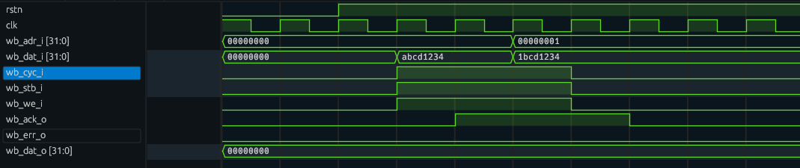

[Cocotb](https://www.cocotb.org/) is a convenient way to write your hardware verification tests in Python.
Let's see how to use it with the OSS toolchain.

<!--more-->

The example used in this article is available on [Github](https://github.com/jpf91/neosd/tree/e882c4f03c1c8ad55bd722e76d1c376831c37574), so you can see the complete example there.

## Installing Dependencies

Once again I will reuse the distrobox container introduced in the [first article]() of this series as the development system.

First, let's create a project directory somewhere.
Let's place our HDL in `src/hdl` and our test sources in `test`.
Then let's create `test/requirements.txt` with this content:
```ini
cocotb==1.9.2
cocotbext-wishbone
```

This specifies the python packages we want to use in our testbench.
Please note that [OSS CAD Suite](https://github.com/YosysHQ/oss-cad-suite-build) already uses a release candidate of cocotb 2.0.
We want to stick to version 1 for now, so we'll have to downgrade.


  Ideally, we would do all our package installation in a Python venv like this:
  ```bash
  python3 -m venv .venv
  source .venv/bin/activate
  ```
  Unfortunately, venv support is currently broken in OSS CAD Suite, see [issue 138](https://github.com/YosysHQ/oss-cad-suite-build/pull/138).
  Using the system python executable is also not possible, see [issue 80](https://github.com/YosysHQ/oss-cad-suite-build/issues/80).


As venvs are currently broken, we will install the dependencies in the system location.
Please note that you might have to clean up `$HOME/.local/bin` and `$HOME/.local/lib/python3.*` if you already have those libraries installed there.

```bash
cd test
python3 -m pip install -r requirements.txt
```

## The Wishbone Slave

The [Wishbone slave code](https://github.com/jpf91/neosd/blob/e882c4f03c1c8ad55bd722e76d1c376831c37574/src/hdl/neosd.v) is quite simple and is essentially the code presented in the [ZipCPU Blog](https://zipcpu.com/zipcpu/2017/05/29/simple-wishbone.html), with signals renamed to match the NEORV32 style.
For your convenience, here is the full code:
```verilog
module neosd (
    input clk_i,
    input rstn_i,

    input[31:0] wb_adr_i,
    input[31:0] wb_dat_i,
    input wb_we_i,
    input[3:0] wb_sel_i,
    input wb_stb_i,
    input wb_cyc_i,

    output reg wb_ack_o,
    output wb_err_o,
    output reg[31:0] wb_dat_o
);
    // Wishbone code based on https://zipcpu.com/zipcpu/2017/05/29/simple-wishbone.html
    wire wb_stall_o;

    always @(posedge clk_i) begin
        if (wb_stb_i && wb_we_i && !wb_stall_o) begin
            // Your write logic here, such as
            // memory[i_addr] <= i_data;
        end
    end

    always @(posedge clk_i) begin
        case (wb_adr_i)
            32'h0: wb_dat_o <= 32'h00000000;
            default: wb_dat_o <= 32'h00000000;
        endcase
    end

    always @(posedge clk_i) begin
        if (rstn_i == 1'b0)
            wb_ack_o <= 1'b0;
        else
            wb_ack_o <= (wb_stb_i && !wb_stall_o);
    end

    assign wb_stall_o = 1'b0;
    assign wb_err_o = 1'b0;

endmodule
```

## The Testbench

With the basic module ready, we have to write the testbench.
It consists of two parts:
Various wrapper files to set up cocotb and the actual testbench in Python.

### Wrapper Files

First, we will need a [top-level file](https://github.com/jpf91/neosd/blob/e882c4f03c1c8ad55bd722e76d1c376831c37574/test/tb.v) in `test/tb.v` wrapping our Wishbone slave:
```verilog
`default_nettype none
`timescale 1ns / 1ps

module tb ();

    initial begin
        $dumpfile("tb.vcd");
        $dumpvars(0, tb);
        #1;
    end

    reg clk;
    reg rstn;

    reg[31:0] wb_adr_i;
    reg[31:0] wb_dat_i;
    reg wb_we_i;
    reg[3:0] wb_sel_i;
    reg wb_stb_i;
    reg wb_cyc_i;

    wire wb_ack_o;
    wire wb_err_o;
    wire[31:0] wb_dat_o;

    neosd dut (
        .clk_i(clk),
        .rstn_i(rstn),
    
        .wb_adr_i(wb_adr_i),
        .wb_dat_i(wb_dat_i),
        .wb_we_i(wb_we_i),
        .wb_sel_i(wb_sel_i),
        .wb_stb_i(wb_stb_i),
        .wb_cyc_i(wb_cyc_i),
    
        .wb_ack_o(wb_ack_o),
        .wb_err_o(wb_err_o),
        .wb_dat_o(wb_dat_o)
    );

endmodule
```

The `initial begin` block ensures to dump all signals to `tb.vcd`.
The remaining module simply instantiates the `neosd` Wishbone slave.
Top-level signals will be driven by the Python testbench.

In addition, we need the [`Makefile`](https://github.com/jpf91/neosd/blob/e882c4f03c1c8ad55bd722e76d1c376831c37574/test/Makefile), which I have adapted from the [Tiny Tapeout template](https://github.com/TinyTapeout/tt10-verilog-template/blob/main/test/Makefile):
```Makefile
# Makefile
# See https://docs.cocotb.org/en/stable/quickstart.html for more info

# defaults
SIM ?= icarus
TOPLEVEL_LANG ?= verilog
SRC_DIR = $(PWD)/../src/hdl
PROJECT_SOURCES = neosd.v

# RTL simulation:
SIM_BUILD = sim_build/rtl
VERILOG_SOURCES += $(addprefix $(SRC_DIR)/,$(PROJECT_SOURCES))

# Allow sharing configuration between design and testbench via `include`:
COMPILE_ARGS 		+= -I$(SRC_DIR)

# Include the testbench sources:
VERILOG_SOURCES += $(PWD)/tb.v
TOPLEVEL = tb

# MODULE is the basename of the Python test file
MODULE = test

# include cocotb's make rules to take care of the simulator setup
include $(shell cocotb-config --makefiles)/Makefile.sim
```

For now, we'll use `iverilog` as simulator.
It is slower than Verilator but has the huge benefit of supporting high-impedance and undefined signal states.
This makes it easier to see if you forgot to properly assign signals, or if your reset logic is broken.

Although not strictly required, a [`.gitignore`](https://github.com/jpf91/neosd/blob/e882c4f03c1c8ad55bd722e76d1c376831c37574/test/.gitignore) file is also quite useful.

### The Main Python Test

Now for the interesting part: The main testbench.
As already indicated by the `requirements.txt` file, we will make use of the [cocotbext-wishbone](https://github.com/wallento/cocotbext-wishbone) library.

The [testbench file](https://github.com/jpf91/neosd/blob/e882c4f03c1c8ad55bd722e76d1c376831c37574/test/test.py) then first contains all required imports:
```python
import cocotb
from cocotb.clock import Clock
from cocotb.triggers import ClockCycles

from cocotbext.wishbone.driver import WishboneMaster
from cocotbext.wishbone.driver import WBOp
```

Next, we define the test and log a start message:
```python
@cocotb.test()
async def test_project(dut):
    dut._log.info("Start")
```

Let's create a 100 MHz clock:
```python
    # Set the clock to 100 MHz
    clock = Clock(dut.clk, 10, units="ns")
    cocotb.start_soon(clock.start())
```

We can now configure the `cocotbext-wishbone` driver:
```python
    wbs = WishboneMaster(dut, "", dut.clk,
        width=32,
        timeout=10,
        signals_dict={"cyc":  "wb_cyc_i",
                    "stb":  "wb_stb_i",
                    "we":   "wb_we_i",
                    "adr":  "wb_adr_i",
                    "datwr":"wb_dat_i",
                    "datrd":"wb_dat_o",
                    "ack":  "wb_ack_o" })
```


  I'm not yet sure how to handle the byte write enable and the error signal with this library.


Then perform the reset sequence:
```python
    # Reset
    dut._log.info("Reset")
    dut.rstn.value = 0
    await ClockCycles(dut.clk, 3)
    dut.rstn.value = 1
```

As the final step, let's issue two write requests to the slave.
Let's write `0xabcd1234` to address `0` and `0x1bcd1234` to address `1`:
```python
    await wbs.send_cycle([WBOp(0, 0xabcd1234), WBOp(1, 0x1bcd1234)])
    await ClockCycles(dut.clk, 3)
```

We also wait 3 clock cycles in the end to slightly extend the waveforms.

## Running the Simulation

with all the setup in place, running the simulation is simple:
```bash
cd test
make
```
This is the beginning of the output you should get:
```
rm -f results.xml
"make" -f Makefile results.xml
make[1]: Entering directory '/home/jpfau/Dokumente/Projekte/FPGA/neosd/test'
/opt/oss-cad-suite/bin/iverilog -o sim_build/rtl/sim.vvp -D COCOTB_SIM=1 -s tb -g2012 -I/home/jpfau/Dokumente/Projekte/FPGA/neosd/test/../src/hdl -f sim_build/rtl/cmds.f  /home/jpfau/Dokumente/Projekte/FPGA/neosd/test/../src/hdl/neosd.v /home/jpfau/Dokumente/Projekte/FPGA/neosd/test/tb.v
rm -f results.xml
MODULE=test TESTCASE= TOPLEVEL=tb TOPLEVEL_LANG=verilog \
         /opt/oss-cad-suite/bin/vvp -M /opt/oss-cad-suite/lib/python3.11/site-packages/cocotb/libs -m libcocotbvpi_icarus   sim_build/rtl/sim.vvp  
     -.--ns INFO     gpi                                ..mbed/gpi_embed.cpp:108  in set_program_name_in_venv        Using Python virtual environment interpreter at /opt/oss-cad-suite/bin/python
     -.--ns INFO     gpi                                ../gpi/GpiCommon.cpp:101  in gpi_print_registered_impl       VPI registered
     0.00ns INFO     cocotb                             Running on Icarus Verilog version 13.0 (devel)
     0.00ns INFO     cocotb                             Running tests with cocotb v1.9.2 from /opt/oss-cad-suite/lib/python3.11/site-packages/cocotb
     0.00ns INFO     cocotb                             Seeding Python random module with 1741120577
     0.00ns INFO     cocotb.regression                  Found test test.test_project
     0.00ns INFO     cocotb.regression                  running test_project (1/1)
     0.00ns INFO     cocotb.tb                          Start
     0.00ns INFO     cocotb.tb                          Reset
VCD info: dumpfile tb.vcd opened for output.
...
```

You can then open `test/tv.vcd` in [surfer](https://surfer-project.org/) to view the simulation waveform:
