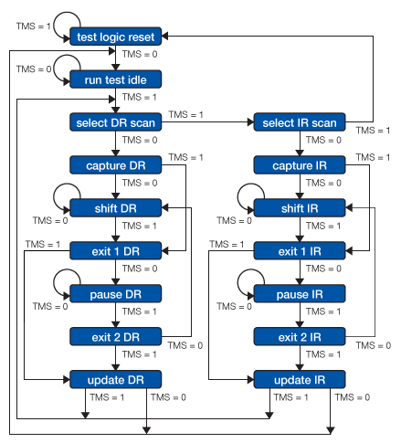
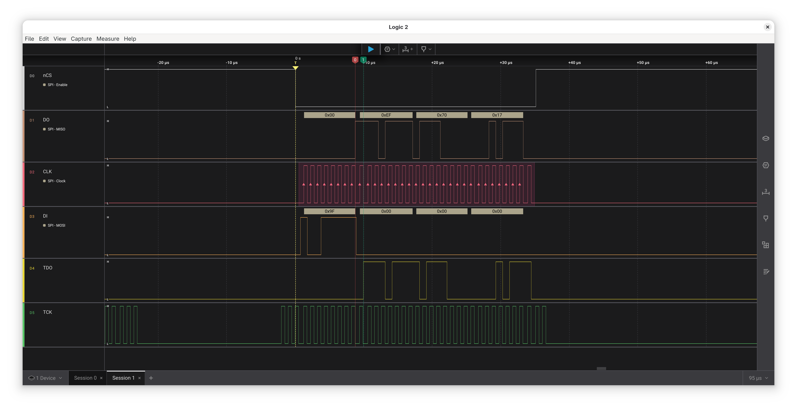
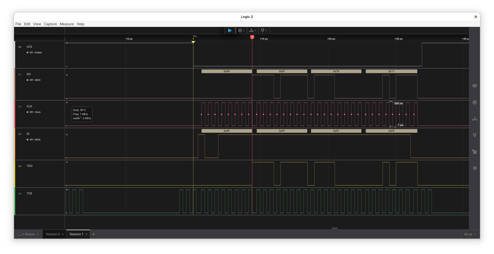

FPGAs and microcontrollers often need to store some sort of configuration on SPI flash.
Whereas we could always use external programmers or code or bitstreams to access the flash, various products have come up with a more clever solution: JTAGSPI.
JTAGSPI tunnels SPI over JTAG, so that we can program our SPI flash using a basic JTAG programmer.
Let's see how to implement an OpenOCD compatible JTAGSPI solution in our JTAG TAPs.

<!--more-->

## Background Story

We're currently planning to tape-out the RISC-V SoC developed in the PSoC lab course at my university.
When preparing the design for that, it was immediately obvious that memory (SRAM) is going to be the largest part of the chip.
NeoRV32, the SoC we use, copies applications completely into instruction ram memory by default.
As we however want to be able to run fairly large FreeRTOS based programs, we would need quite a lot of SRAM.

### Executing Code from Flash

To avoid this issue, we can use the execute-in-place (XIP) peripheral included with the NeoRV32 SoC.
The XIP peripheral maps SPI flash into the address space, so programs can execute directly from flash.
We still want to configure an instruction cache though, as otherwise the whole system would become incredibly slow.
However, this instruction cache can be much smaller than the total instruction memory.

### XIP Bootloaders

To boot from XIP, we need a bootloader.
The one shipped with NEORV32 is quite large though, as it uses a text based UART interface.
The bootloader needs to be stored in ROM, so to reduce chip area we also need to reduce the bootloader size.
The specialized [neorv32-xip-bootloader](https://github.com/betocool-prog/neorv32-xip-bootloader) XIP bootloader is already smaller, but still large.
Even for this bootloader, the size is still mostly determined by UART interaction.

As an alternative, I've written a [minimal bootloader](https://github.com/kit-kch/psoc-xip-bootloader/blob/main/bootloader_tiny/bootloader_xip.c) that boots directly from XIP and compiles to only [six instructions](https://github.com/kit-kch/psoc-xip-bootloader/blob/main/bootloader_tiny/neorv32_bootloader_image.vhd). 
This minimal bootloader can however no longer program the SPI flash via UART.
We could use external programmers for the SPI flash, but there's a better solution:
We already use the JTAG TAP in NEORV32 for debugging anyway.
When using the default SRAM backed instruction memory, JTAG can also be used with OpenOCD and GDB to upload executables.
The only thing we need now is a way for GDB to program our flash instead of the SRAM using JTAG...

Luckily this is a problem many people had before and there is a common solution: JTAGSPI.

## Tunneling SPI Over JTAG

The solution adopted by many flash-based microcontrollers and by many FPGAs is JTAGSPI.
The OpenOCD documentation explains the basic idea:

> To access this flash from the host, some FPGA device provides dedicated JTAG instructions, while other FPGA devices should be programmed with a special proxy bitstream that exposes the SPI flash on the device’s JTAG interface. The flash can then be accessed through JTAG.
> 
> Since signalling between JTAG and SPI is compatible, all that is required for a proxy bitstream is to connect TDI-MOSI, TDO-MISO, TCK-CLK and activate the flash chip select when the JTAG state machine is in SHIFT-DR.
>
> — [OpenOCD Documentation](https://openocd.org/doc/html/Flash-Commands.html")

### JTAG Basics

In order to understand this brief description, it is necessary to understand some JTAG concepts first.
JTAG essentially forms a register scan chain, which can be used to shift data using the `TCK` clock, is driven by the `TDI` input and sends the output to the `TDO` signal.
In addition to those signals, JTAG also has a control signal called `TMS`, driving a standardized state machine.

This FSM is given by the figure below, often repeated in JTAG tutorials and taken from [xjtag.com](https://www.xjtag.com/about-jtag/jtag-a-technical-overview/):


Whereas this figure explains the low-level idea of JTAG, the high-level aspects are often assumed and not explained in detail.
Here are the main points:
* `IR` is an instruction register.
  Shift in different instructions to achieve different effects.
  Usually `IR` values are treated like addresses, selecting what data the `DR` "register" accesses.
* JTAG defines some standard `IR` values:
  One for reading out the default scan chain and one for bypass, which connects `TDI` to `TDO` using a single flip-flop to reduce total chain length.
* Both instruction are not really useful to us, but we can add our own instructions.
* Neither the length of the `IR` nor the `DR` registers are defined by the specification.
  Tools like OpenOCD however expect a fixed `IR` length and it needs to be specified in the tool configuration.
* The usual high-level programming flow is like this:
  1. Optional: Reset
  2. Shift in `IR`
  3. Access `DR`

### JTAGSPI Instructions

The OpenOCD documentation is telling us that a JTAG TAP can simply connect `TDI` with SPI `MOSI` and `TDO` with SPI `MISO` in the `shift DR` state.
When doing this, the data send and received on the JTAG link is directly forwarded to the SPI device.

To make use of this, OpenOCD implements generic flash access in the `jtagspi` driver.
However, as the documentation notes, how to enter this specific *SPI Bypass* depends on the JTAG TAP vendor.

In general, there are two options:
Either implementing a special `IR` instruction to activate this mode or using some out-of-band method.
The out-of-band method is commonly used for FPGAs, but it makes little sense for our NEORV32 microcontroller.
We're therefore going to implement a custom instruction in the JTAG TAP to activate JTAGSPI.

## Modifying the NEORV32 JTAG TAP

The code implementing JTAGSPI support in the NEORV32 JTAG TAP can be found [in this commit](https://github.com/kit-kch/psoc-neorv32/commit/33a981d2052d08817f6e2dabaefc19b3105b4880). 

Most of the changes are straightforward.
We introduce new `jtagspi_*` port signals and define `addr_spi_c = 0b10010` as our `IR` value for JTAG bypass.
I also introduce `bypass_spi` and `bypass_spi_clk` control signals in the TAP register state.

To drive the signals, I simply forward gated versions of the JTAG signals:

```vhdl
-- SPI forwarding
jtagspi_sck_o <= tap_sync.tck and tap_reg.bypass_spi_clk;
jtagspi_sdo_o <= tap_sync.tdi;
jtagspi_csn_o <= not tap_reg.bypass_spi;
```

The NEORV32 TAP implements the JTAG FSM shown previously in an extra process.
We therefore don't have to modify this code in any way.

In the state machine handling the register output, we extend the `DR_CAPTURE` to set the `bypass_spi` bit.
`bypass_spi_clk` will be set one cycle later, in the `DR_SHIFT` state.
This ensures that we don't get a clock edge aligned with the SPI slave enable edge.
There needs to be some delay between these edges, as otherwise variations in timing delay on the physical SPI wire could cause issues (e.g. if the clock edge arrives before the slave enable edge, it will be ignored).
Finally, we deassert both control bits in the `DR_EXIT1` state.

Finally, you probably want to mux your normal SPI driver and JTAGSPI on one port:
```vhdl
-- jtagspi mux
xip_csn_o <= jtagspi_csn and xip_csn;
xip_clk_o <= jtagspi_sck when jtagspi_csn = '0' else xip_clk;
xip_sdo_o <= jtagspi_sdo when jtagspi_csn = '0' else xip_sdo;
```

### Getting the Timing Right

There's one final change needed in the `TDO` signal logic:
The NEORV32 TAP shifts out data on the falling `TDO` edge.
If we do that with our sampled SPI data, we will introduce a delay of one `TCK` cycle.
This effect can be seen in the following signal trace, which shows the SPI flash signals at the top and the `TDO` and `TCK` JTAG signals at the bottom:



In general, the OpenOCD `jtagspi` code can deal with that.
However, I think it's still preferable to have no delay here.
I therefore changed the code like this:
```vhdl
if (tap_reg.bypass_spi = '1') then
  jtag_tdo_o <= jtagspi_sdi_i;
elsif (tap_sync.tck_falling = '1') then
  -- [JTAG-SYNC] update TDO on falling edge of TCK
```

This results in the following timing:



Note that there still is one system clock delay, as the assignment code is in a clocked code block.
You now might wonder if we won't get into metastability issues here:
After all, we are sampling an externally clocked signal asynchronously using another clock...
So do we need a double-FF synchronizer here?

The answer becomes obvious if you think about how the double-FF synchronizer works:
Immediately after the clock edge, the first FF output might be unstable.
We then however assume a high probability that it settles to a stable value during one clock cycle.
The second FF will then sample a stable signal.
This is primarily important for combinatorial logic connected to the FF output.
The solution works fine because all your further processing will just happen one clock cycle later.

Now in our case, we are outputting the signal to JTAG, where it will be sampled using yet another clock, `TCK`.
`TCK` is much slower than our system clock.
If we assume that the first FF output settles in one system clock cycle, it for sure settles until the next `TCK` edge arrives.

In general, the most tricky part of JTAGSPI is getting the SPI waveform completely correct, so using a logic analyzer to validate this is a good idea.

## Adding Support in OpenOCD

OpenOCD has various backend drivers, so I hoped I could repurpose one of them.
In the simplest configuration, `jtagspi` can be used without any `pll` driver and it can be configured to just use a specific `IR` value.
Unfortunately, this mode is meant to be used for specific FPGA bitstreams:
OpenOCD does not just speak raw data here, it adds additional protocol bytes to the SPI transfers.
This mode therefore does not work for our simple JTAGSPI implementation.

I then considered using the `gatemate` driver, which is quite simple.
Unfortunately, the `IR` value it uses is already used for something else in NEORV32.
In the end, I ended up creating a new [`neorv32` driver](https://github.com/kit-kch/psoc-openocd/commit/bd577aad8a9d6b2afd2c503b4e5400600c96edb7) based on the `gatemate` one.

To use this new driver, simply extend your NEORV32 JTAG config with these lines:

```tcl
# ----------------------------------------------
# Flash programming
# ----------------------------------------------
pld create neorv32.pld neorv32 -chain-position neorv32.cpu
flash bank spi_flash jtagspi 0xE0000000 0 0 0 neorv32.cpu.0 -pld neorv32.pld
```

Where the `pld` needs to be attached to the CPU JTAG tap.
`0xE0000000` is the address where the XIP maps the flash to in the CPU address space.
If we specify this here properly, GDB will know that this memory region is backed by flash memory.

## Testing with GDB

We can now test programming our SPI flash using GDB.
First, start OpenOCD:
```bash
./src/openocd -c 'adapter serial 210249B1B925' -f openocd_neorv32_jtaghs2.cfg
```

Then start GDB and connect:
```bash
riscv-none-elf-gdb
target extended-remote localhost:3333
```


When GDB connects, the OpenOCD output will tell you that it detected an SPI flash:
```bash
Open On-Chip Debugger 0.12.0+dev-02012-g4fe57a0c1-dirty (2025-06-10-09:38)
Licensed under GNU GPL v2
For bug reports, read
	http://openocd.org/doc/doxygen/bugs.html
CMD_ARGC: 4 
Info : clock speed 1000 kHz
Info : JTAG tap: neorv32.cpu tap/device found: 0x0cafe001 (mfg: 0x000 (<invalid>), part: 0xcafe, ver: 0x0)
Info : datacount=1 progbufsize=2
Info : Disabling abstract command reads from CSRs.
Info : Examined RISC-V core; found 1 harts
Info :  hart 0: XLEN=32, misa=0x40901106
Info : [neorv32.cpu.0] Examination succeed
Info : [neorv32.cpu.0] starting gdb server on 3333
Info : Listening on port 3333 for gdb connections
Target HALTED.
Ready for remote connections.
Info : Listening on port 6666 for tcl connections
Info : Listening on port 4444 for telnet connections
Info : accepting 'gdb' connection on tcp/3333
Info : Found flash device 'win w25q64jv' (ID 0x1770ef)
```

In GDB, we can now just open and load files as usual.
As we specified the address where the SPI flash is mapped, GDB will automatically program these memory areas using the SPI flash driver.
Furthermore, it will also assume that the memory range is read only, so it will use hardware breakpoints automatically.
This makes debugging code loaded from XIP much more convenient.

```
(gdb) file main.elf
Reading symbols from main.elf...
(gdb) load
Loading section .text, size 0x1038 lma 0xe0000000
Loading section .rodata, size 0x880 lma 0xe0001038
Start address 0xe0000000, load size 6328
Transfer rate: 17 KB/sec, 3164 bytes/write.
(gdb) break main
Breakpoint 1 at 0xe00001f8
Note: automatically using hardware breakpoints for read-only addresses.
```

To software-reset a program, you then should just jump to the bootloader entrypoint:
```bash
j *(0xffe00000)
```

## Future Steps

As next steps, I want to make the `neorv32` OpenOCD driver more generic, e.g. making the `IR` value and the number of additional read and write bits configurable.
I'd then try to get this generic driver upstreamed, so we don't have to work with patched OpenOCD versions.

I'll also try to get the JTAGSPI code upstreamed into NEORV32.
Unfortunately, NEORV32 has recently removed the XIP code.
Although JTAGSPI can be used with any SPI device, I'm not sure if there is any other real use case.